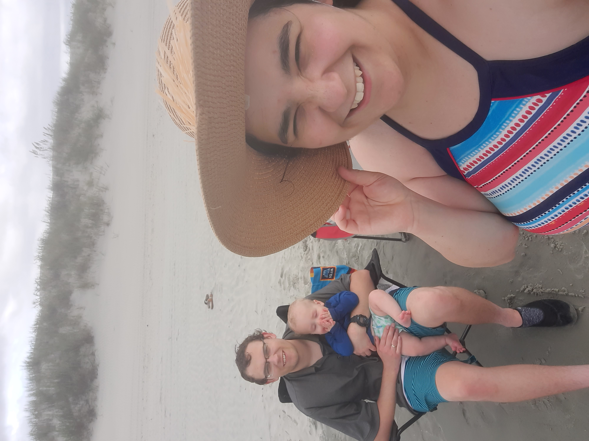

<b>Name:</b> Thomas Jamieson
 
<b>Background:</b>
Hey all! I started my programming back in 2018 when I first started college at BYU-I. I did two semesters and then when on a mission to the Independence, Missouri mission. My best language is Python, and I definitely am more of a back end developer. The I also like database and would love to get more experance working with them.
 
<b>Home:</b>
I was born and raised in Fallon, Nevada.
 
<b>Interests:</b>
I like sports, board and video games, and technology. My family has always been really big into board and card games and that is pretty much what we do when we get together. I played tennis in high school and have gotten into pickleball recently.
 
<b>Unique:</b>
I've got a basic website that is a portfolio for me. Here is a link: https://thomasjamiesonprograms.com/
 
<b>Photo:</b>

My in laws got together at a beach in North Carolina. Here is my wife, my baby Teddy, and me.
 
<b>Resume:</b>
[Thomas Jamieson - Resume](<Thomas Jamieson_Resume.pdf>)
There are several things that make me stand out from my resume. One thing is my minor in Electrical and Computer Engineering. These studies have given me a much greater understanding of how the technology that we work with every day works. As a programmer it is helpful to have an understanding of the inner workings of computers. Another aspect of my resume that I think stands out are some of my projects.

[Thomas Jamieson - Cover Letter](<Thomas Jamieson Cover Letter.pdf>)

 
<b>LinkedIn:</b>
https://www.linkedin.com/in/thomasjohnjamieson/